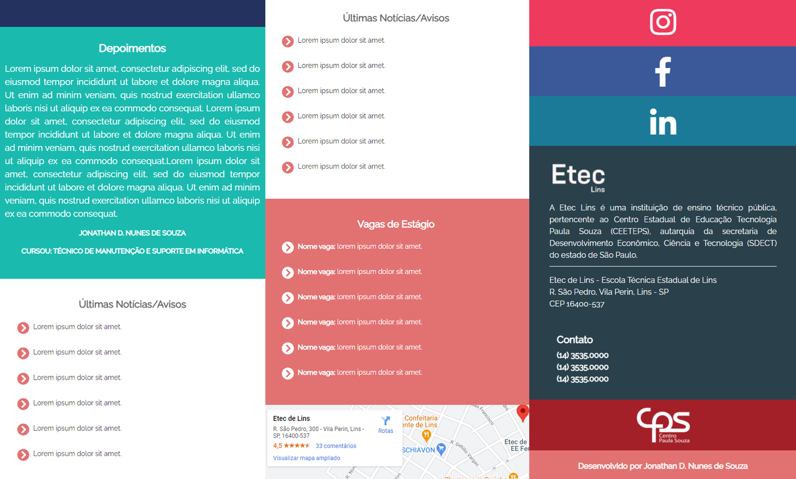
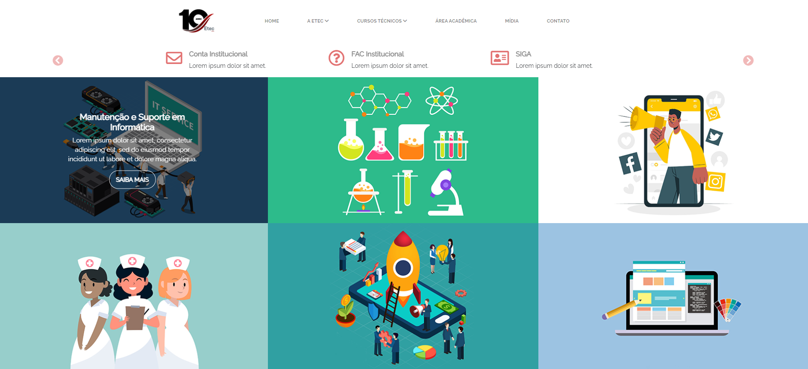
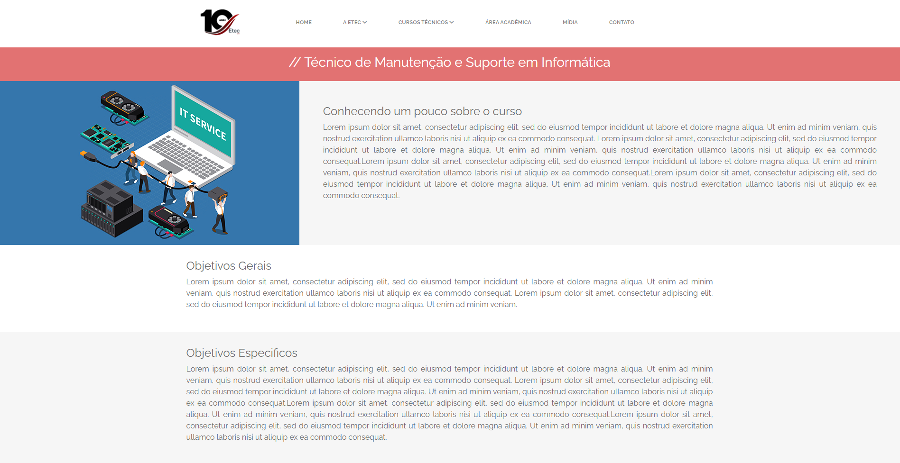

# Site institucional CEETEPS - Etec de Lins
>Este projeto é um re-design site da instituição [CEETEPS] - [Etec de Lins] desenvolvido p/ fins educacionais com a intenção de aplicar os conceitos aprendidos em aula sobre front-end.

Este projeto é um site estático desenvolvido p/ fins educacionais com a intenção de tangibilizar meus conhecimentos em front-end.

## Exibição Mobile




## Exibição em Desktop






## Instalação

Para executar o projeto localmente o repositório deve ser clonado da forma desejada:

```
git clone https://github.com/jonathannunesdsouza/eteclins.github.io.git
```

## Histórico de atualização 

* 0.0.1;
    * Lançamento inicial.

## Meta 

Jonathan Douglas Nunes de Souza - [@jonathansouza] - <jonathannunes.souza98@gmail.com>

[@jonathansouza]:https://www.linkedin.com/in/perfil-in/

Distribuido sob licença. Veja **`LICENÇA`** para mais informações.

[https://github.com/jonathannunesdsouza/jonathannunesdsouza.github.io]


[Etec de Lins]:https://eteclins.com.br
[CEETEPS]:https://centropaulasouza.com.br
